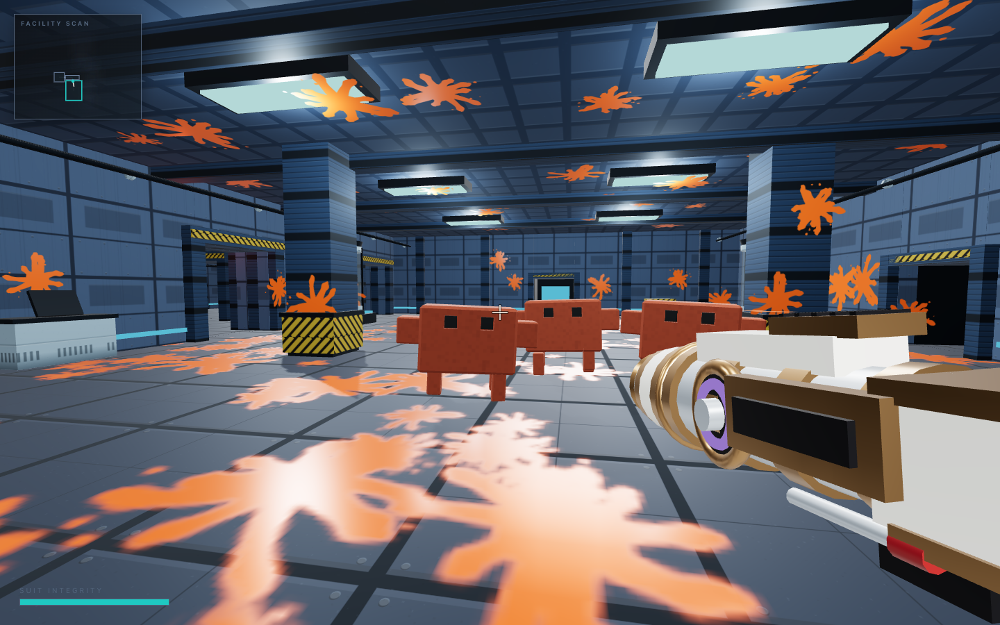

# Clawd Pop 3D — Public Beta

Escape into a different compact laboratory every run. Pop waves of blocky
specimens with a handless gold-and-silver cannon, paint the facility orange,
and restore containment before your suit gives out.

> **Play now:** [Launch Clawd Pop 3D](https://vibezzzcoder.github.io/clawd-pop/)



*Desktop gameplay on the High quality preset. The facility, Clawds, cannon,
lighting, textures, and splat effects are all generated at runtime.*

This is a playable public beta. The complete procedural run is here now, along
with an Options screen for audio level, look sensitivity, inverted aim, touch
auto-fire and graphics quality; Walker, Runner and Heavy specimens; escalating
laboratory sectors with alarm layers; improved wet-centre splats; a mid-run
containment machine that produces a finite mini-Clawd brood; and a final swarm
encounter with a visibly telegraphed brood release.

Everything you see and hear is procedurally generated by the game at
startup—geometry, textures, effects, and audio. No image, sound, or font assets ship with it.

## How to play

### Desktop and laptop

- Move: `WASD`
- Look: mouse or trackpad drag
- Fire: left click
- Sprint: `Shift`
- Pause: `Esc`
- Mute: `M`

The game may ask to capture the pointer for free-look. If the browser declines,
click-and-drag aiming and firing still work.

### iPhone, phone, or tablet

- Move with the lower-left stick.
- Drag on the right side to aim.
- Tap the aim area to fire at the centre reticle.
- Toggle **Run** at the top right.
- Pause from the top centre.

Portrait and landscape are supported. Portrait uses faster turning to make up
for its shorter thumb travel, while landscape remains the recommended
first-person layout.

### Options

**Options** is on the title screen and on the pause screen. It carries master and
effects volume, look sensitivity for mouse and touch, inverted vertical aim,
auto-fire on touch, and graphics quality.

- **Auto-fire on touch** is off by default. With it on, resting a thumb anywhere
  on the aim side keeps the cannon firing on its own cooldown, so you never have
  to tap — aiming and firing become one gesture.
- **Quality** is probed for your device automatically. Choosing a level yourself
  applies the resolution change immediately; shadows, textures and effect budgets
  need the reload the screen offers.
- **Adaptive quality** is on by default and only ever lowers resolution, one step,
  if frames stay slow for a sustained stretch of play.

Options apply straight away and last for the session; reloading returns to the
defaults. Nothing in here changes the facility a seed generates.

### Best iPhone experience

Safari's tabs, address bar, and bookmark strip reduce the space available to any
browser game. For the cleanest full-screen-like layout:

1. Open the play link in Safari.
2. Tap **Share**.
3. Choose **Add to Home Screen**.
4. Launch Clawd Pop 3D from its new Home Screen icon.

An internet connection is currently required to open the game. Offline play is
not yet promised.

## About this beta

Runs are seeded and reproducible, so replaying the same seed recreates the same
facility. The build supports desktop and touch controls, portrait and landscape,
generated audio, scalable quality presets, pause/retry, same-seed or new-seed
restarts, a mid-run production machine whose core releases mini-Clawds, and a
final chamber whose boss releases its own swarm.

Feedback from real phones is especially useful while the beta's touch defaults
are being refined.

## Preview a downloaded copy

This build uses JavaScript modules, so serve the folder rather than opening
`index.html` directly. One simple local command is:

```sh
python3 -m http.server 8000
```

Then visit `http://127.0.0.1:8000/`.

## License and notice

The game is released under the [MIT License](LICENSE). See
[NOTICE.md](NOTICE.md) for the fan-project disclaimer and the Three.js license.
